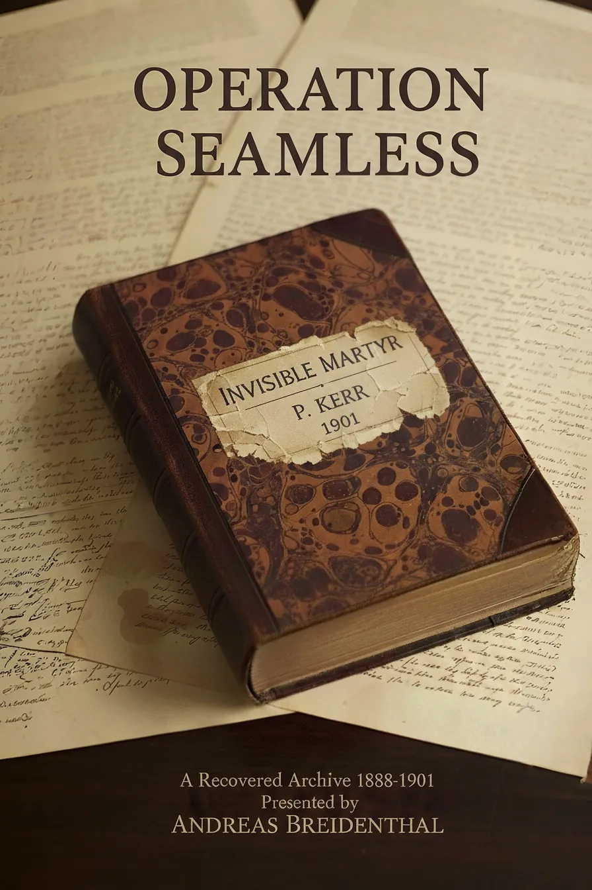

# Operation Seamless

**_A Recovered Archive, 1888–1901_**

*Presented by Andreas Breidenthal*

***

*Operation Seamless* is a work of fiction presented as a recovered Victorian archive. It gathers letters, reports, and personal testimonies surrounding a violent incident in Bishopsgate in 1888 — and the covert effort to erase it from history.

Blending historical detail with invented voices, the book explores how silence, secrecy, and missing records shape what we believe to be true. Every document is imagined, yet grounded in real streets, institutions, and archival practices.

What begins as a fragmentary record becomes a story of erasure, obsession, and the fragile seams of history.  

[Begin reading →](https://andreas-breidenthal.github.io/operation-seamless/foreword.html)

## Contents

### Prefatory Matter

* **—** [Foreword](https://andreas-breidenthal.github.io/operation-seamless/foreword.html)  
  *Presented by Andreas Breidenthal* (`Foreword`)

### The First Cache · Aldgate, 2021

* **I**[Archivist's Note](https://andreas-breidenthal.github.io/operation-seamless/aldgate-archivists-note.html)  
  *BGI/ALD/2021/037 — The Aldgate Manuscript* (`Archive Record`)

* **II** [The Aldgate Manuscript](https://andreas-breidenthal.github.io/operation-seamless/aldgate-manuscript.html)  
  *Testimony of Thomas Alexander Davies, c. 1889* (`Transcript`)

* **III**[Beyond the Fog](https://andreas-breidenthal.github.io/operation-seamless/beyond-the-fog.html)  
  *A Critical Analysis of The Aldgate Manuscript — Dr Charlotte Sablier, 2023* (`Academic Paper`)

### The Second Cache · West Ham, 2023

* **IV** [Archivist's Note](https://andreas-breidenthal.github.io/operation-seamless/swift-archivists-note.html)  
  *BGI/SWF/2024/041 — Swift's Account and Document Cache* (`Archive Record`)

* **V**[Swift's Account](https://andreas-breidenthal.github.io/operation-seamless/swifts-account-ch1.html)  
  *Chapters 1–11 · The testimony of Henry Swift* (`Transcript`)

* **VI** [Swift's Document Cache](https://andreas-breidenthal.github.io/operation-seamless/document-cache.html)  
  *Nine primary documents recovered with the account* (`Artifacts`)

* **VII** [Operation Seamless and the Ripper Suppression](https://andreas-breidenthal.github.io/operation-seamless/marlowe-paper.html)  
  *Uncovering a Hidden Archive — Felix Marlowe, 2023* (`Academic Paper`)

* **VIII**[Beyond the Fog and Into the Archive](https://andreas-breidenthal.github.io/operation-seamless/beyond-the-fog-2.html)  
  *Reassessing The Aldgate Manuscript — Dr Charlotte Sablier, 2024* (`Academic Paper`)

### The Third Cache · Chigwell, 2025

* **IX** [Archivist's Note](https://andreas-breidenthal.github.io/operation-seamless/im-archivists-note.html)  
  *BGI/RLS/2025/052 — Invisible Martyr* (`Archive Record`)

* **X**[Invisible Martyr](https://andreas-breidenthal.github.io/operation-seamless/im-authors-note.html)  
  *The memoir of Percival Kerr · Chapters 1–14 & Postscript* (`Memoir`)

* **XI** [The Fog Thickens](https://andreas-breidenthal.github.io/operation-seamless/fog-thickens.html)  
  *A Final Examination of the Bishopsgate Archive — 2025* (`Academic Paper`)

### Closing Matter

* **—** [Afterword](https://andreas-breidenthal.github.io/operation-seamless/afterword.html)  
  *The creation of Operation Seamless · Andreas Breidenthal* (`Afterword`)
